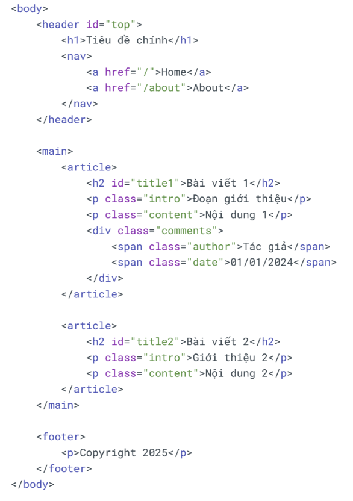

# Lesson 06 takeaways

## 1. DOM - relation


* **Self**: Node hiện tại.
* **Parent (Cha)**: Node phía trên trực tiếp của node hiện tại.
* **Children (Con)**: Node phía dưới trực tiếp của node hiện tại.
* **Ancestor (Tổ tiên)**: Bao gồm cha, ông nội... (tất cả các cấp trên).
* **Descendant (Hậu duệ)**: Bao gồm con, cháu, chắt... (tất cả các cấp dưới).
* **Sibling**: Là những phần tử cùng cấp và cùng cha.
* **Following**: Gồm các node ở phía bên tay phải của node hiện tại. (NOTE: *không lấy* những thằng con của node hiện tại)
* **Preceding**: Gồm các node ở phía bên tay trái của node hiện tại, **trừ các node ancestor**.
* **Following-sibling**: Anh em phía sau (= following + sibling)

* **Preceding-sibling**: Anh em phía trước (= preceding + sibling)


## 2. XPath Advance Methods
XPath axes methods (phương thức trục XPath) là các phương pháp để điều hướng và chọn các node trong cây DOM XML/HTML dựa trên mối quan hệ giữa các node với nhau.
Cách điều hướng để chọn các node dựa trên mối quan hệ vị trí:

**Công dụng**:
- Tìm kiếm elements dựa trên vị trí tương đối (parent, child, sibling, ancestor...)
- Linh hoạt hơn việc chỉ dùng đường dẫn tuyệt đối hoặc tương đối


### ***Wildcard***: *
Nghĩa là khớp tất cả. VD:

`//div` -> khớp thẻ div

`//*` -> khớp tất cả các loại thẻ

### ***child - Con trực tiếp***

VD:
```
# Tìm tất cả các button con trực tiếp của form
//form[@id='test-form']/child::button

# Kết quả: button "Create Test Case" và "Reset Form"
```

### ***descendant - Tất cả con cháu***

VD:
```
# Tìm tất cả input bên trong form (mọi cấp)
//form[@id='test-form']/descendant::input

# Kết quả: input testName, priority (bên trong div.form-group)
```

### ***parent - Tìm cha***

VD:
```
# Tìm form cha của button "Create Test Case" 
//button[text()='Create Test Case']/parent::form

# Kết quả:
form#test-form
```

### ***ancestor - Tìm tổ tiên***

VD:
```
# Từ button "Edit" trong table, tìm table tổ tiên //button[@class='btn-edit']/ancestor::table

# Kết quả: table#test-table
```

### ***following-sibling - Anh em phía sau***

VD:
```
# Từ label "Test Case Name", tìm input cùng cấp ngay sau nó
//label[@for='testName']/following-sibling::input
# Kết quả: input#testName

—--

# Từ cột "Test Name" có text "Login Validation", lấy các cột tiếp theo
//td[text()='Login Validation']/following-sibling::td
# Kết quả: cột Type, Priority, Status, Actions
```

### ***preceding-sibling - Anh em đứng trước***

VD:
```
# Từ button "Reset Form", tìm button đứng trước nó
//button[@class='btn-reset']/preceding-sibling::button

# Kết quả: button "Create Test Case"
```

### ***following - Tất cả node sau trong document***

VD:
```
# Từ h2 "Test Cases List", tìm tất cả button "Run Test" phía sau
//h2[text()='Test Cases List']/following::button[@class='btn-run']

# Kết quả: Tất cả 5 button "Run Test" trong bảng
```


### ***ancestor-or-self - Tổ tiên hoặc chính nó***

VD:
```
# Tìm tất cả span status trong table (bao gồm cả chính nó nếu là span)
//table[@id='test-table']/ancestor-or-self::span[contains(@class, 'status')]

# Kết quả: Tất cả span status-passed, status-running, status-failed, status-pending
```

### ***preceding - Tất cả node trước trong document***

VD:
```
# Từ h2 "Test Execution Results", tìm tất cả td có text "High" phía trước
//h2[text()='Test Execution Results']/preceding::td[@class='priority-high']

# Kết quả: TC001 và TC003 priority cells
```

### ***descendant-or-self - Con cháu hoặc chính nó***

VD:
```
# Tìm tất cả span status trong table (bao gồm cả chính nó nếu là span)
//table[@id='test-table']/descendant-or-self::span[contains(@class, 'status')]

# Kết quả: Tất cả span status-passed, status-running, status-failed, status-pending
```

### ***Chứa thuộc tính: @attribute***

Sử dụng @ để truy cập thuộc tính của element.

VD:

`//tagname[@attribute='value']`


### ***AND và OR operators***

- **AND - Tất cả điều kiện phải đúng**

    `//element[@condition1 and @condition2]`

- **OR - Một trong các điều kiện đúng**

    `//element[@condition1 or @condition2]`

- **Kết hợp AND và OR**

### ***Lấy text bên trong element***

text() lấy text node trực tiếp của element.

`//element[text()='exact text']`

### ***normalize-space(): Chuẩn hóa khoảng trắng***

Loại bỏ khoảng trắng thừa ở đầu, cuối và giữa text.

`normalize-space(string)`


### ***contains(): Kiểm tra chứa chuỗi con***

Tìm element có chứa một phần text, không cần khớp chính xác.


```
//element[contains(@attribute, 'substring')]
//element[contains(text(), 'substring')]
```

---

### ***Tổng hợp XPath functions***

| Function | Cú pháp | Mô tả | Ví dụ |
| :--- | :--- | :--- | :--- |
| **concat()** | `concat(str1, str2, ...)` | Nối các chuỗi lại với nhau | `concat('Hello', ' ', 'World')` → 'Hello World' |
| **starts-with()** | `starts-with(str, prefix)` | Kiểm tra chuỗi bắt đầu bằng prefix | `//input[starts-with(@id, 'user')]` |
| **ends-with()** | `ends-with(str, suffix)` | Kiểm tra chuỗi kết thúc bằng suffix | `ends-with('hello.txt', '.txt')` → true |
| **contains()** | `contains(str, substring)` | Kiểm tra chuỗi chứa substring | `//div[contains(@class, 'active')]` |
| **string-length()** | `string-length(str?)` | Trả về độ dài chuỗi | `string-length('Hello')` → 5 |
| **normalize-space()** | `normalize-space(str?)` | Loại bỏ khoảng trắng thừa | `normalize-space(' Hello World ')` → 'Hello World' |
| **translate()** | `translate(str, from, to)` | Thay thế ký tự trong chuỗi | `translate('abc', 'ab', 'AB')` → 'ABc' |
| **lower-case()** | `lower-case(string)` | Chuyển thành chữ thường | `lower-case('HELLO')` → 'hello' |
| **upper-case()** | `upper-case(string)` | Chuyển thành chữ HOA | `upper-case('hello')` → 'HELLO' |
| **replace()** | `replace(str, pattern, replacement)` | Thay thế theo regex | `replace('hello', 'l', 'L')` → 'heLLo' |
| **tokenize()** | `tokenize(str, pattern)` | Tách chuỗi theo pattern | `tokenize('a,b,c', ',')` → ('a','b','c') |

---
---
### ***Tổng hợp XPath axes***

### 2. Các trục XPath (XPath Axes)

| Axis | Cú pháp | Mô tả | Ví dụ | Kết quả |
| :--- | :--- | :--- | :--- | :--- |
| **child** | `child::node` | Chọn tất cả node con trực tiếp | `//div/child::p` | Tất cả `<p>` là con trực tiếp của `<div>` |
| **descendant** | `descendant::node` | Chọn tất cả node con cháu (mọi cấp) | `//div/descendant::span` | Tất cả `<span>` bên trong `<div>` ở bất kỳ cấp nào |
| **parent** | `parent::node` | Chọn node cha trực tiếp | `//p/parent::div` | Thẻ `<div>` là cha của `<p>` |
| **ancestor** | `ancestor::node` | Chọn tất cả node tổ tiên (cha, ông...) | `//span/ancestor::div` | Tất cả `<div>` là tổ tiên của `<span>` |
| **following-sibling** | `following-sibling::node` | Chọn các node anh em đứng sau (cùng cấp) | `//h2/following-sibling::p` | Tất cả `<p>` đứng sau `<h2>` cùng cấp |
| **preceding-sibling** | `preceding-sibling::node` | Chọn các node anh em đứng trước (cùng cấp) | `//h3/preceding-sibling::h2` | Tất cả `<h2>` đứng trước `<h3>` cùng cấp |
| **following** | `following::node` | Chọn tất cả node sau trong document | `//h1/following::p` | Tất cả `<p>` xuất hiện sau `<h1>` trong toàn bộ tài liệu |
| **preceding** | `preceding::node` | Chọn tất cả node trước trong document | `//footer/preceding::div` | Tất cả `<div>` xuất hiện trước `<footer>` |
| **attribute** | `attribute::name` hoặc `@name` | Chọn thuộc tính của node | `//div/attribute::class` hoặc `//div/@class` | Thuộc tính class của `<div>` |
| **self** | `self::node` | Chọn chính node hiện tại | `//p/self::p` | Chính node `<p>` đó |
| **descendant-or-self** | `descendant-or-self::node` | Chọn node hiện tại + tất cả con cháu | `//div/descendant-or-self::*` | `<div>` và tất cả node bên trong |
| **ancestor-or-self** | `ancestor-or-self::node` | Chọn node hiện tại + tất cả tổ tiên | `//span/ancestor-or-self::div` | `<span>` và tất cả `<div>` tổ tiên |
| **namespace** | `namespace::prefix` | Chọn namespace nodes | `//element/namespace::*` | Tất cả namespace của element |

---

## 3. Ví Dụ Chi Tiết Với HTML Mẫu



* **Bảng Ví Dụ Thực Tế**

| XPath Expression | Kết quả | Giải thích |
| :--- | :--- | :--- |
| `//h2[@id='title1']/parent::article` | `<article>` chứa "Bài viết 1" | Chọn cha của h2 |
| `//article/child::p` | Tất cả `<p>` con trực tiếp của article | Chỉ p cấp 1, không lấy p trong div |
| `//article/descendant::span` | `<span class="author">` và `<span class="date">` | Tất cả span bên trong article |
| `//h2[@id='title1']/following-sibling::p` | `<p class="intro">` và `<p class="content">` của bài 1 | Các p anh em sau h2 |
| `//p[@class='content']/preceding-sibling::p` | `<p class="intro">` | p anh em đứng trước |
| `//span[@class='author']/ancestor::article` | `<article>` chứa span đó | Tổ tiên article của span |
| `//h2[@id='title1']/following::article` | `<article>` chứa "Bài viết 2" | Article xuất hiện sau h2 trong document |
| `//footer/preceding::h2` | Cả 2 thẻ `<h2>` | Tất cả h2 xuất hiện trước footer |
| `//nav/child::a` | 2 thẻ `<a>` trong nav | Các link trong nav |
| `//span[@class='date']/parent::div/@class` | "comments" | Lấy class của div cha |
---

* **Bảng So Sánh Axes Tương Tự**

| Nhóm | Axes | Khác Biệt |
| :--- | :--- | :--- |
| **Con cháu** | `child::` | Chỉ con trực tiếp (cấp 1) |
| | `descendant::` | Tất cả con cháu (mọi cấp) |
| | `descendant-or-self::` | Bao gồm cả chính nó |
| **Tổ tiên** | `parent::` | Chỉ cha trực tiếp |
| | `ancestor::` | Tất cả tổ tiên |
| | `ancestor-or-self::` | Bao gồm cả chính nó |
| **Anh em** | `following-sibling::` | Anh em sau (cùng cấp) |
| | `preceding-sibling::` | Anh em trước (cùng cấp) |
| **Toàn document** | `following::` | Tất cả node sau (mọi cấp) |
| | `preceding::` | Tất cả node trước (mọi cấp) |
---

* **Ví Dụ Kết Hợp Nhiều Axes**

```
// Tìm article, rồi lấy tất cả p con
//article/child::p

// Tìm span, lên cha (div), rồi lấy tất cả span anh em
//span[@class='author']/parent::div/child::span

// Tìm h2 đầu tiên, lấy 2 p anh em sau nó
//h2[@id='title1']/following-sibling::p[position() <= 2]

// Tìm span date, lên article tổ tiên, xuống lấy h2
//span[@class='date']/ancestor::article/child::h2

// Tìm p intro, lấy tất cả element anh em sau
//p[@class='intro']/following-sibling::*

// Tìm footer, lấy tất cả div trước nó trong document
//footer/preceding::div

// Tìm nav, lấy tất cả a con có href
//nav/child::a[@href]

// Tìm article thứ 2, lấy article anh em trước nó
//article[2]/preceding-sibling::article
```